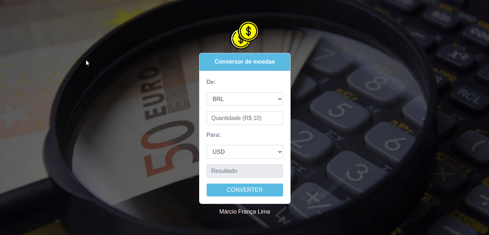

# Conversor de Moedas (pt-BR)

Aplicação desenvolvida com Ruby on Rails para praticar os conceitos básicos da stack de tecnologias.

## Tecnologias

- Ruby on Rails
- Docker
- Postgres
- rest-client
- RSpec
- Webmock
- Javascript

Foi usado a api [Currency Data Feed](https://currencydatafeed.com/) para obter dados reais da cotação. 

Made with 💜 by Márcio França Lima. [Contact me](https://www.linkedin.com/in/m%C3%A1rcio-fran%C3%A7a-lima-916454187/)